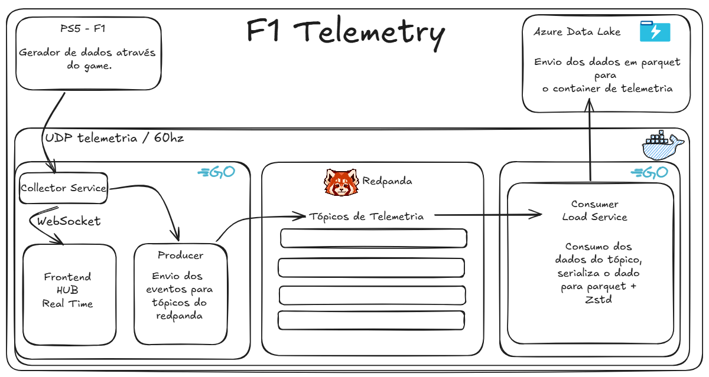

# 🏁 F1 Telemetry Ingestion Hub

[](https://go.dev/)
[](https://www.docker.com/)
[](https://redpanda.com/)
[-green.svg)](https://parquet.apache.org/)

O **F1 Telemetry Ingestion Hub** é um pipeline de ingestão de dados em tempo real de alta performance projetado para capturar, transmitir, exibir e persistir os dados de telemetria transmitidos por jogos de Fórmula 1 da Codemasters (F1 2025 no meu caso) rodando no PS5.

O sistema separa de forma desacoplada a ingestão de rede em alta frequência (via UDP), a renderização visual em tempo real no navegador (via WebSockets) e o armazenamento analítico de Big Data em nuvem/local (arquivos Parquet comprimidos enviados ao Azure Data Lake Gen2).

---

## 🏗️ Arquitetura do Sistema

A telemetria do jogo é enviada via **UDP na porta 20777** em uma frequência de até **60 Hz** (60 pacotes por segundo). Para suportar esse fluxo de dados sem perda de pacotes, a aplicação adota uma arquitetura desacoplada:



### Escolhas de Design e Tecnologia

1.  **Go (Golang)**: Escolhido pela alta concorrência nativa (Goroutines) e eficiência de memória, permitindo processar pacotes a 60Hz com latência sub-milissegundo.
2.  **Redpanda**: Utilizado como message broker intermediário para desacoplar a ingestão da escrita física em disco/nuvem. Se o upload para o Azure ADLS cair temporariamente, as mensagens ficam salvas no broker, evitando perda de dados.
3.  **WebSocket**: Transmite métricas críticas direto do coletor para a interface web (velocidade, marcha, RPM, pedais, temperatura dos pneus) sem necessidade de pooling ou de consultar banco de dados.
4.  **Apache Parquet com ZStandard (Zstd)**: Os arquivos persistidos são gravados em formato colunar Parquet e comprimidos via Zstd. Como dados de telemetria são repetitivos, o Zstd reduz o tamanho do arquivo em mais de **90%**, diminuindo drasticamente os custos de armazenamento e banda na nuvem.


## ⚡ Recursos Principais

*   **Ingestão UDP Otimizada**: Uso de `sync.Pool` de buffers para evitar alocações de memória RAM repetitivas (*garbage collection pressure*).
*   **Live HUD Dashboard**: Interface com visualizadores de RPM, mapeamento térmico de pneus, velocidade, marcha, etc.
*   **Controle de Ingestão Dinâmico**: Permite iniciar e pausar a captura dos dados de telemetria diretamente da UI web.
*   **Buffer Inteligente de Escrita (Anti-Small Files)**:
    *   **Alta Frequência** (*Telemetry*, *Motion*, *Lap*): Grava no Data Lake a cada 15.000 registros ou 2 minutos.
    *   **Baixa Frequência** (*Participants*, *Setups*, *Tyres*): Grava a cada 1.000 registros ou 10 minutos para evitar criação de milhares de arquivos minúsculos.

---

## 📁 Estrutura do Projeto

```text
├── cmd
│   ├── collector/        # Código-fonte do servidor UDP e Web UI
│   └── sink/             # Código-fonte do gravador (Redpanda Consumer e Parquet Engine)
├── internal
│   ├── config/           # Estruturas e overrides de configuração por env
│   ├── models/           # Parser de pacotes binários do F1 e structs de mapeamento
│   ├── network/          # Socket UDP Listener assíncrono
│   ├── queue/            # Implementação do produtor Redpanda
│   └── storage/          # Escritor de arquivos Parquet e upload Azure ADLS Gen2
├── web
│   └── static/           # Interface Frontend (HTML, CSS, JS)
├── Dockerfile            # Arquivo de build multi-stage do projeto
└── docker-compose.yml    # Orquestração do Redpanda, f1-collector e f1-sink
```

---

## 🚀 Como Executar o Projeto via Docker

Siga os passos abaixo para clonar, configurar e rodar o projeto na sua máquina em poucos minutos:

### 1. Pré-requisitos
*   [Docker](https://docs.docker.com/get-docker/) instalado.
*   [Docker Compose](https://docs.docker.com/compose/install/) instalado.

### 2. Configurando o Ambiente
Abra o arquivo `docker-compose.yml` na raiz do projeto. Caso possua uma conta de armazenamento no **Azure Data Lake Storage Gen2**, substitua as credenciais sob o serviço `f1-sink`:

```yaml
  f1-sink:
    # ...
    environment:
      - REDPANDA_BROKER=redpanda:19092
      # Credenciais do Azure ADLS Gen2 (Opcional - caso em branco, salvará em disco local)
      - AZURE_STORAGE_ACCOUNT_NAME=sua_storage_account
      - AZURE_STORAGE_ACCOUNT_KEY=sua_chave_de_acesso
      - AZURE_STORAGE_CONTAINER=seu_container
      - AZURE_STORAGE_DIRECTORY=telemetry-raw
```

> [!TIP]
> **Dica de Persistência Local:** Se as credenciais do Azure não forem fornecidas, o processador salvará os arquivos Parquet compactados diretamente na pasta `./data/parquet` do seu computador (mapeada automaticamente através de volumes do Docker).

### 3. Subindo os Contêineres
No terminal, na pasta raiz do projeto, execute o comando:

```bash
docker compose up --build -d
```

Este comando irá:
1.  Fazer o download da imagem do Redpanda (Broker).
2.  Compilar os binários de Go (`f1-collector` e `f1-sink`) de forma estática dentro do container.
3.  Iniciar todos os serviços em segundo plano.

Para validar que os contêineres estão rodando corretamente:
```bash
docker compose ps
```

### 4. Configurando a Telemetria no Jogo (F1 2024 / F1 2025)
1.  Abra o jogo de F1 em seu console (PS5/Xbox) ou PC.
2.  Vá em **Configurações** > **Opções de Telemetria**.
3.  Ajuste os seguintes campos:
    *   **Telemetria UDP**: `Ligado`
    *   **Envio de Telemetria**: `Público` ou `Privado` (caso esteja no PC rodando localmente)
    *   **Endereço IP**: O IP da máquina onde o contêiner Docker está rodando (caso esteja no mesmo PC, use `127.0.0.1` ou o IP de rede da máquina).
    *   **Porta UDP**: `20777`
    *   **Frequência de Envio**: `60Hz` (ou de sua preferência)
    *   **Formato de Telemetria**: `2024` ou `2025`

### 5. Acessando o Dashboard
Abra seu navegador e acesse:
[http://localhost:8080](http://localhost:8080)

*   Clique no botão **"Configurações"** para revisar se a porta UDP e o broker apontam para os valores corretos.
*   Clique em **"Iniciar Captura"** para abrir o socket UDP. Assim que você entrar na pista no jogo, os dados começarão a preencher o HUD instantaneamente!
