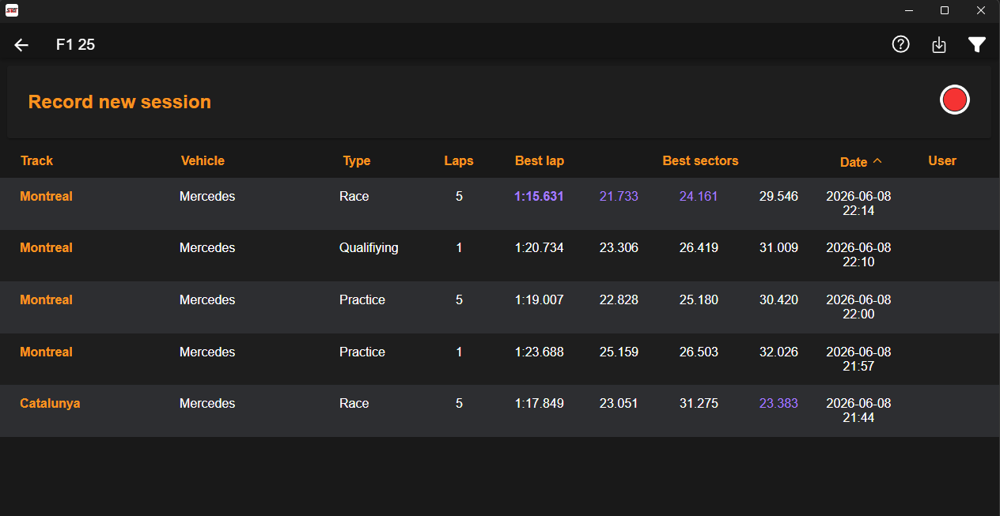

Interface da aplicação:

Crie uma interface minimalista de captura de dados, contendo apenas os seguintes campos:
- Track: Nome da pista
- Vehicle: Nome do veículo
- Type: Tipo de evento
- Laps: Número de voltas
- Best Lap: Melhor volta
- Best Sectors: Melhores setores
- Date: Data do evento

Um exemplo de interface pode ser encontrado na imagem anexa.

Preciso de uma interface que seja limpa, objetiva e que permita a captura de dados de forma rápida e eficiente.

Além disso, a interface deve permitir a configuração dos seguintes parâmetros:
- UDP Port: Porta UDP para escuta dos dados (padrão: 20777)
- Kafka Broker: Endereço do broker Kafka (padrão: localhost:9092)
- Kafka Topic: Tópico Kafka para envio dos dados (padrão: f1-telemetry)
- Azure ADLS Gen2 Storage Account: Conta de armazenamento Azure Data Lake Storage Gen2
- Azure ADLS Gen2 Container: Container Azure Data Lake Storage Gen2
- Azure ADLS Gen2 Directory: Diretório Azure Data Lake Storage Gen2 para armazenamento dos dados

